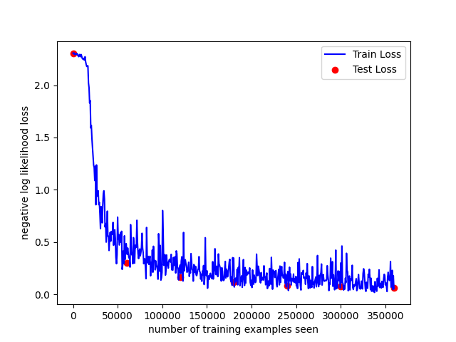

# 習題七

**修改自老師的 [lenetRelu.py][lenet] 和 [train.py][train]**

[lenet]: https://github.com/ccc112b/py2cs/blob/master/03-人工智慧/05-神經網路/02-深度學習/01-MNIST/lenetRelu.py
[train]: https://github.com/ccc112b/py2cs/blob/master/03-人工智慧/05-神經網路/02-深度學習/01-MNIST/train.py



```
$ python -W ignore train.py model

Test set: Avg. loss: 2.3061, Accuracy: 1009/10000 (10%)

Train Epoch: 1 [0/60000 (0%)]   Loss: 2.295828
Train Epoch: 1 [640/60000 (1%)] Loss: 2.311475
Train Epoch: 1 [1280/60000 (2%)]        Loss: 2.313339
Train Epoch: 1 [1920/60000 (3%)]        Loss: 2.296337
Train Epoch: 1 [2560/60000 (4%)]        Loss: 2.306131
Train Epoch: 1 [3200/60000 (5%)]        Loss: 2.309164
Train Epoch: 1 [3840/60000 (6%)]        Loss: 2.301570
Train Epoch: 1 [4480/60000 (7%)]        Loss: 2.293715
Train Epoch: 1 [5120/60000 (9%)]        Loss: 2.292783
Train Epoch: 1 [5760/60000 (10%)]       Loss: 2.291451
Train Epoch: 1 [6400/60000 (11%)]       Loss: 2.301206
Train Epoch: 1 [7040/60000 (12%)]       Loss: 2.292395
Train Epoch: 1 [7680/60000 (13%)]       Loss: 2.285499
Train Epoch: 1 [8320/60000 (14%)]       Loss: 2.283116
Train Epoch: 1 [8960/60000 (15%)]       Loss: 2.278237
Train Epoch: 1 [9600/60000 (16%)]       Loss: 2.265759
Train Epoch: 1 [10240/60000 (17%)]      Loss: 2.256113
Train Epoch: 1 [10880/60000 (18%)]      Loss: 2.259646
Train Epoch: 1 [11520/60000 (19%)]      Loss: 2.239924
Train Epoch: 1 [12160/60000 (20%)]      Loss: 2.245032
Train Epoch: 1 [12800/60000 (21%)]      Loss: 2.219662
Train Epoch: 1 [13440/60000 (22%)]      Loss: 2.229226
Train Epoch: 1 [14080/60000 (23%)]      Loss: 2.186300
Train Epoch: 1 [14720/60000 (25%)]      Loss: 2.133309
Train Epoch: 1 [15360/60000 (26%)]      Loss: 2.053150
Train Epoch: 1 [16000/60000 (27%)]      Loss: 1.995157
Train Epoch: 1 [16640/60000 (28%)]      Loss: 1.932542
Train Epoch: 1 [17280/60000 (29%)]      Loss: 1.670428
Train Epoch: 1 [17920/60000 (30%)]      Loss: 1.653119
Train Epoch: 1 [18560/60000 (31%)]      Loss: 1.349502
Train Epoch: 1 [19200/60000 (32%)]      Loss: 1.184047
Train Epoch: 1 [19840/60000 (33%)]      Loss: 1.149395
Train Epoch: 1 [20480/60000 (34%)]      Loss: 1.180376
Train Epoch: 1 [21120/60000 (35%)]      Loss: 1.212870
Train Epoch: 1 [21760/60000 (36%)]      Loss: 0.838974
Train Epoch: 1 [22400/60000 (37%)]      Loss: 1.053184
Train Epoch: 1 [23040/60000 (38%)]      Loss: 1.161457
Train Epoch: 1 [23680/60000 (39%)]      Loss: 0.757432
Train Epoch: 1 [24320/60000 (41%)]      Loss: 0.829520
Train Epoch: 1 [24960/60000 (42%)]      Loss: 0.827440
Train Epoch: 1 [25600/60000 (43%)]      Loss: 0.839479
Train Epoch: 1 [26240/60000 (44%)]      Loss: 0.782011
Train Epoch: 1 [26880/60000 (45%)]      Loss: 0.719080
Train Epoch: 1 [27520/60000 (46%)]      Loss: 0.534862
Train Epoch: 1 [28160/60000 (47%)]      Loss: 0.645372
Train Epoch: 1 [28800/60000 (48%)]      Loss: 0.918910
Train Epoch: 1 [29440/60000 (49%)]      Loss: 0.746800
Train Epoch: 1 [30080/60000 (50%)]      Loss: 0.685947
Train Epoch: 1 [30720/60000 (51%)]      Loss: 0.638608
Train Epoch: 1 [31360/60000 (52%)]      Loss: 0.745150
Train Epoch: 1 [32000/60000 (53%)]      Loss: 0.714017
Train Epoch: 1 [32640/60000 (54%)]      Loss: 0.682264
Train Epoch: 1 [33280/60000 (55%)]      Loss: 0.617230
Train Epoch: 1 [33920/60000 (57%)]      Loss: 0.391357
Train Epoch: 1 [34560/60000 (58%)]      Loss: 0.361692
Train Epoch: 1 [35200/60000 (59%)]      Loss: 0.547005
Train Epoch: 1 [35840/60000 (60%)]      Loss: 0.651780
Train Epoch: 1 [36480/60000 (61%)]      Loss: 0.476756
Train Epoch: 1 [37120/60000 (62%)]      Loss: 0.390802
Train Epoch: 1 [37760/60000 (63%)]      Loss: 0.576789
Train Epoch: 1 [38400/60000 (64%)]      Loss: 0.539448
Train Epoch: 1 [39040/60000 (65%)]      Loss: 0.645560
Train Epoch: 1 [39680/60000 (66%)]      Loss: 0.428848
Train Epoch: 1 [40320/60000 (67%)]      Loss: 0.355628
Train Epoch: 1 [40960/60000 (68%)]      Loss: 0.693667
Train Epoch: 1 [41600/60000 (69%)]      Loss: 0.551199
Train Epoch: 1 [42240/60000 (70%)]      Loss: 0.532665
Train Epoch: 1 [42880/60000 (71%)]      Loss: 0.416800
Train Epoch: 1 [43520/60000 (72%)]      Loss: 0.715447
Train Epoch: 1 [44160/60000 (74%)]      Loss: 0.598929
Train Epoch: 1 [44800/60000 (75%)]      Loss: 0.568738
Train Epoch: 1 [45440/60000 (76%)]      Loss: 0.801260
Train Epoch: 1 [46080/60000 (77%)]      Loss: 0.455553
Train Epoch: 1 [46720/60000 (78%)]      Loss: 0.367204
Train Epoch: 1 [47360/60000 (79%)]      Loss: 0.435997
Train Epoch: 1 [48000/60000 (80%)]      Loss: 0.613920
Train Epoch: 1 [48640/60000 (81%)]      Loss: 0.330095
Train Epoch: 1 [49280/60000 (82%)]      Loss: 0.541680
Train Epoch: 1 [49920/60000 (83%)]      Loss: 0.464565
Train Epoch: 1 [50560/60000 (84%)]      Loss: 0.547218
Train Epoch: 1 [51200/60000 (85%)]      Loss: 0.433026
Train Epoch: 1 [51840/60000 (86%)]      Loss: 0.379377
Train Epoch: 1 [52480/60000 (87%)]      Loss: 0.717222
Train Epoch: 1 [53120/60000 (88%)]      Loss: 0.628692
Train Epoch: 1 [53760/60000 (90%)]      Loss: 0.460294
Train Epoch: 1 [54400/60000 (91%)]      Loss: 0.523230
Train Epoch: 1 [55040/60000 (92%)]      Loss: 0.274378
Train Epoch: 1 [55680/60000 (93%)]      Loss: 0.490117
Train Epoch: 1 [56320/60000 (94%)]      Loss: 0.432769
Train Epoch: 1 [56960/60000 (95%)]      Loss: 0.459405
Train Epoch: 1 [57600/60000 (96%)]      Loss: 0.417226
Train Epoch: 1 [58240/60000 (97%)]      Loss: 0.413932
Train Epoch: 1 [58880/60000 (98%)]      Loss: 0.519803
Train Epoch: 1 [59520/60000 (99%)]      Loss: 0.492116

Test set: Avg. loss: 0.2739, Accuracy: 9189/10000 (92%)

Train Epoch: 2 [0/60000 (0%)]   Loss: 0.397424
Train Epoch: 2 [640/60000 (1%)] Loss: 0.309128
Train Epoch: 2 [1280/60000 (2%)]        Loss: 0.326255
Train Epoch: 2 [1920/60000 (3%)]        Loss: 0.462521
Train Epoch: 2 [2560/60000 (4%)]        Loss: 0.442888
Train Epoch: 2 [3200/60000 (5%)]        Loss: 0.471972
Train Epoch: 2 [3840/60000 (6%)]        Loss: 0.357926
Train Epoch: 2 [4480/60000 (7%)]        Loss: 0.240246
Train Epoch: 2 [5120/60000 (9%)]        Loss: 0.436667
Train Epoch: 2 [5760/60000 (10%)]       Loss: 0.409412
Train Epoch: 2 [6400/60000 (11%)]       Loss: 0.384931
Train Epoch: 2 [7040/60000 (12%)]       Loss: 0.424398
Train Epoch: 2 [7680/60000 (13%)]       Loss: 0.459169
Train Epoch: 2 [8320/60000 (14%)]       Loss: 0.596105
Train Epoch: 2 [8960/60000 (15%)]       Loss: 0.357701
Train Epoch: 2 [9600/60000 (16%)]       Loss: 0.351526
Train Epoch: 2 [10240/60000 (17%)]      Loss: 0.641358
Train Epoch: 2 [10880/60000 (18%)]      Loss: 0.151182
Train Epoch: 2 [11520/60000 (19%)]      Loss: 0.288161
Train Epoch: 2 [12160/60000 (20%)]      Loss: 0.292416
Train Epoch: 2 [12800/60000 (21%)]      Loss: 0.477470
Train Epoch: 2 [13440/60000 (22%)]      Loss: 0.588093
Train Epoch: 2 [14080/60000 (23%)]      Loss: 0.663856
Train Epoch: 2 [14720/60000 (25%)]      Loss: 0.295595
Train Epoch: 2 [15360/60000 (26%)]      Loss: 0.205545
Train Epoch: 2 [16000/60000 (27%)]      Loss: 0.568653
Train Epoch: 2 [16640/60000 (28%)]      Loss: 0.262430
Train Epoch: 2 [17280/60000 (29%)]      Loss: 0.411728
Train Epoch: 2 [17920/60000 (30%)]      Loss: 0.352855
Train Epoch: 2 [18560/60000 (31%)]      Loss: 0.438823
Train Epoch: 2 [19200/60000 (32%)]      Loss: 0.412474
Train Epoch: 2 [19840/60000 (33%)]      Loss: 0.305040
Train Epoch: 2 [20480/60000 (34%)]      Loss: 0.266074
Train Epoch: 2 [21120/60000 (35%)]      Loss: 0.195511
Train Epoch: 2 [21760/60000 (36%)]      Loss: 0.168375
Train Epoch: 2 [22400/60000 (37%)]      Loss: 0.450664
Train Epoch: 2 [23040/60000 (38%)]      Loss: 0.404817
Train Epoch: 2 [23680/60000 (39%)]      Loss: 0.516302
Train Epoch: 2 [24320/60000 (41%)]      Loss: 0.353200
Train Epoch: 2 [24960/60000 (42%)]      Loss: 0.246222
Train Epoch: 2 [25600/60000 (43%)]      Loss: 0.280728
Train Epoch: 2 [26240/60000 (44%)]      Loss: 0.417818
Train Epoch: 2 [26880/60000 (45%)]      Loss: 0.439194
Train Epoch: 2 [27520/60000 (46%)]      Loss: 0.352113
Train Epoch: 2 [28160/60000 (47%)]      Loss: 0.308805
Train Epoch: 2 [28800/60000 (48%)]      Loss: 0.265560
Train Epoch: 2 [29440/60000 (49%)]      Loss: 0.383001
Train Epoch: 2 [30080/60000 (50%)]      Loss: 0.406545
Train Epoch: 2 [30720/60000 (51%)]      Loss: 0.367332
Train Epoch: 2 [31360/60000 (52%)]      Loss: 0.160458
Train Epoch: 2 [32000/60000 (53%)]      Loss: 0.226454
Train Epoch: 2 [32640/60000 (54%)]      Loss: 0.260969
Train Epoch: 2 [33280/60000 (55%)]      Loss: 0.284812
Train Epoch: 2 [33920/60000 (57%)]      Loss: 0.223563
Train Epoch: 2 [34560/60000 (58%)]      Loss: 0.395018
Train Epoch: 2 [35200/60000 (59%)]      Loss: 0.215940
Train Epoch: 2 [35840/60000 (60%)]      Loss: 0.239165
Train Epoch: 2 [36480/60000 (61%)]      Loss: 0.332911
Train Epoch: 2 [37120/60000 (62%)]      Loss: 0.379307
Train Epoch: 2 [37760/60000 (63%)]      Loss: 0.253603
Train Epoch: 2 [38400/60000 (64%)]      Loss: 0.409158
Train Epoch: 2 [39040/60000 (65%)]      Loss: 0.283041
Train Epoch: 2 [39680/60000 (66%)]      Loss: 0.197280
Train Epoch: 2 [40320/60000 (67%)]      Loss: 0.207723
Train Epoch: 2 [40960/60000 (68%)]      Loss: 0.264366
Train Epoch: 2 [41600/60000 (69%)]      Loss: 0.220269
Train Epoch: 2 [42240/60000 (70%)]      Loss: 0.311376
Train Epoch: 2 [42880/60000 (71%)]      Loss: 0.240780
Train Epoch: 2 [43520/60000 (72%)]      Loss: 0.288949
Train Epoch: 2 [44160/60000 (74%)]      Loss: 0.197505
Train Epoch: 2 [44800/60000 (75%)]      Loss: 0.436811
Train Epoch: 2 [45440/60000 (76%)]      Loss: 0.272890
Train Epoch: 2 [46080/60000 (77%)]      Loss: 0.202356
Train Epoch: 2 [46720/60000 (78%)]      Loss: 0.275989
Train Epoch: 2 [47360/60000 (79%)]      Loss: 0.281595
Train Epoch: 2 [48000/60000 (80%)]      Loss: 0.288114
Train Epoch: 2 [48640/60000 (81%)]      Loss: 0.304857
Train Epoch: 2 [49280/60000 (82%)]      Loss: 0.134719
Train Epoch: 2 [49920/60000 (83%)]      Loss: 0.214286
Train Epoch: 2 [50560/60000 (84%)]      Loss: 0.309498
Train Epoch: 2 [51200/60000 (85%)]      Loss: 0.339428
Train Epoch: 2 [51840/60000 (86%)]      Loss: 0.206169
Train Epoch: 2 [52480/60000 (87%)]      Loss: 0.128654
Train Epoch: 2 [53120/60000 (88%)]      Loss: 0.209231
Train Epoch: 2 [53760/60000 (90%)]      Loss: 0.266724
Train Epoch: 2 [54400/60000 (91%)]      Loss: 0.290228
Train Epoch: 2 [55040/60000 (92%)]      Loss: 0.308278
Train Epoch: 2 [55680/60000 (93%)]      Loss: 0.100228
Train Epoch: 2 [56320/60000 (94%)]      Loss: 0.231537
Train Epoch: 2 [56960/60000 (95%)]      Loss: 0.429109
Train Epoch: 2 [57600/60000 (96%)]      Loss: 0.463808
Train Epoch: 2 [58240/60000 (97%)]      Loss: 0.308073
Train Epoch: 2 [58880/60000 (98%)]      Loss: 0.252233
Train Epoch: 2 [59520/60000 (99%)]      Loss: 0.160106

Test set: Avg. loss: 0.1732, Accuracy: 9463/10000 (95%)

Train Epoch: 3 [0/60000 (0%)]   Loss: 0.136871
Train Epoch: 3 [640/60000 (1%)] Loss: 0.143495
Train Epoch: 3 [1280/60000 (2%)]        Loss: 0.187989
Train Epoch: 3 [1920/60000 (3%)]        Loss: 0.232267
Train Epoch: 3 [2560/60000 (4%)]        Loss: 0.220472
Train Epoch: 3 [3200/60000 (5%)]        Loss: 0.137833
Train Epoch: 3 [3840/60000 (6%)]        Loss: 0.187485
Train Epoch: 3 [4480/60000 (7%)]        Loss: 0.366473
Train Epoch: 3 [5120/60000 (9%)]        Loss: 0.278423
Train Epoch: 3 [5760/60000 (10%)]       Loss: 0.081863
Train Epoch: 3 [6400/60000 (11%)]       Loss: 0.111812
Train Epoch: 3 [7040/60000 (12%)]       Loss: 0.138613
Train Epoch: 3 [7680/60000 (13%)]       Loss: 0.208940
Train Epoch: 3 [8320/60000 (14%)]       Loss: 0.218352
Train Epoch: 3 [8960/60000 (15%)]       Loss: 0.222241
Train Epoch: 3 [9600/60000 (16%)]       Loss: 0.407935
Train Epoch: 3 [10240/60000 (17%)]      Loss: 0.287755
Train Epoch: 3 [10880/60000 (18%)]      Loss: 0.138694
Train Epoch: 3 [11520/60000 (19%)]      Loss: 0.233023
Train Epoch: 3 [12160/60000 (20%)]      Loss: 0.153113
Train Epoch: 3 [12800/60000 (21%)]      Loss: 0.133597
Train Epoch: 3 [13440/60000 (22%)]      Loss: 0.150346
Train Epoch: 3 [14080/60000 (23%)]      Loss: 0.169875
Train Epoch: 3 [14720/60000 (25%)]      Loss: 0.171894
Train Epoch: 3 [15360/60000 (26%)]      Loss: 0.204273
Train Epoch: 3 [16000/60000 (27%)]      Loss: 0.219808
Train Epoch: 3 [16640/60000 (28%)]      Loss: 0.150744
Train Epoch: 3 [17280/60000 (29%)]      Loss: 0.380071
Train Epoch: 3 [17920/60000 (30%)]      Loss: 0.353752
Train Epoch: 3 [18560/60000 (31%)]      Loss: 0.204732
Train Epoch: 3 [19200/60000 (32%)]      Loss: 0.223348
Train Epoch: 3 [19840/60000 (33%)]      Loss: 0.264372
Train Epoch: 3 [20480/60000 (34%)]      Loss: 0.467305
Train Epoch: 3 [21120/60000 (35%)]      Loss: 0.173494
Train Epoch: 3 [21760/60000 (36%)]      Loss: 0.180192
Train Epoch: 3 [22400/60000 (37%)]      Loss: 0.216011
Train Epoch: 3 [23040/60000 (38%)]      Loss: 0.170689
Train Epoch: 3 [23680/60000 (39%)]      Loss: 0.180380
Train Epoch: 3 [24320/60000 (41%)]      Loss: 0.251044
Train Epoch: 3 [24960/60000 (42%)]      Loss: 0.174546
Train Epoch: 3 [25600/60000 (43%)]      Loss: 0.207316
Train Epoch: 3 [26240/60000 (44%)]      Loss: 0.124225
Train Epoch: 3 [26880/60000 (45%)]      Loss: 0.352669
Train Epoch: 3 [27520/60000 (46%)]      Loss: 0.249469
Train Epoch: 3 [28160/60000 (47%)]      Loss: 0.246847
Train Epoch: 3 [28800/60000 (48%)]      Loss: 0.182318
Train Epoch: 3 [29440/60000 (49%)]      Loss: 0.144607
Train Epoch: 3 [30080/60000 (50%)]      Loss: 0.095512
Train Epoch: 3 [30720/60000 (51%)]      Loss: 0.179568
Train Epoch: 3 [31360/60000 (52%)]      Loss: 0.193338
Train Epoch: 3 [32000/60000 (53%)]      Loss: 0.159943
Train Epoch: 3 [32640/60000 (54%)]      Loss: 0.342785
Train Epoch: 3 [33280/60000 (55%)]      Loss: 0.247664
Train Epoch: 3 [33920/60000 (57%)]      Loss: 0.337962
Train Epoch: 3 [34560/60000 (58%)]      Loss: 0.163297
Train Epoch: 3 [35200/60000 (59%)]      Loss: 0.212496
Train Epoch: 3 [35840/60000 (60%)]      Loss: 0.164648
Train Epoch: 3 [36480/60000 (61%)]      Loss: 0.267844
Train Epoch: 3 [37120/60000 (62%)]      Loss: 0.135461
Train Epoch: 3 [37760/60000 (63%)]      Loss: 0.336156
Train Epoch: 3 [38400/60000 (64%)]      Loss: 0.092678
Train Epoch: 3 [39040/60000 (65%)]      Loss: 0.334168
Train Epoch: 3 [39680/60000 (66%)]      Loss: 0.100209
Train Epoch: 3 [40320/60000 (67%)]      Loss: 0.218850
Train Epoch: 3 [40960/60000 (68%)]      Loss: 0.325485
Train Epoch: 3 [41600/60000 (69%)]      Loss: 0.246495
Train Epoch: 3 [42240/60000 (70%)]      Loss: 0.100437
Train Epoch: 3 [42880/60000 (71%)]      Loss: 0.094442
Train Epoch: 3 [43520/60000 (72%)]      Loss: 0.266049
Train Epoch: 3 [44160/60000 (74%)]      Loss: 0.103685
Train Epoch: 3 [44800/60000 (75%)]      Loss: 0.151699
Train Epoch: 3 [45440/60000 (76%)]      Loss: 0.113813
Train Epoch: 3 [46080/60000 (77%)]      Loss: 0.182092
Train Epoch: 3 [46720/60000 (78%)]      Loss: 0.356113
Train Epoch: 3 [47360/60000 (79%)]      Loss: 0.153886
Train Epoch: 3 [48000/60000 (80%)]      Loss: 0.379238
Train Epoch: 3 [48640/60000 (81%)]      Loss: 0.303300
Train Epoch: 3 [49280/60000 (82%)]      Loss: 0.164045
Train Epoch: 3 [49920/60000 (83%)]      Loss: 0.254601
Train Epoch: 3 [50560/60000 (84%)]      Loss: 0.232120
Train Epoch: 3 [51200/60000 (85%)]      Loss: 0.074683
Train Epoch: 3 [51840/60000 (86%)]      Loss: 0.179405
Train Epoch: 3 [52480/60000 (87%)]      Loss: 0.093359
Train Epoch: 3 [53120/60000 (88%)]      Loss: 0.248510
Train Epoch: 3 [53760/60000 (90%)]      Loss: 0.166684
Train Epoch: 3 [54400/60000 (91%)]      Loss: 0.178322
Train Epoch: 3 [55040/60000 (92%)]      Loss: 0.308883
Train Epoch: 3 [55680/60000 (93%)]      Loss: 0.138501
Train Epoch: 3 [56320/60000 (94%)]      Loss: 0.224677
Train Epoch: 3 [56960/60000 (95%)]      Loss: 0.158023
Train Epoch: 3 [57600/60000 (96%)]      Loss: 0.114148
Train Epoch: 3 [58240/60000 (97%)]      Loss: 0.233219
Train Epoch: 3 [58880/60000 (98%)]      Loss: 0.137781
Train Epoch: 3 [59520/60000 (99%)]      Loss: 0.171960

Test set: Avg. loss: 0.1154, Accuracy: 9648/10000 (96%)

Train Epoch: 4 [0/60000 (0%)]   Loss: 0.215762
Train Epoch: 4 [640/60000 (1%)] Loss: 0.128856
Train Epoch: 4 [1280/60000 (2%)]        Loss: 0.165545
Train Epoch: 4 [1920/60000 (3%)]        Loss: 0.105528
Train Epoch: 4 [2560/60000 (4%)]        Loss: 0.300339
Train Epoch: 4 [3200/60000 (5%)]        Loss: 0.115238
Train Epoch: 4 [3840/60000 (6%)]        Loss: 0.094998
Train Epoch: 4 [4480/60000 (7%)]        Loss: 0.124388
Train Epoch: 4 [5120/60000 (9%)]        Loss: 0.093498
Train Epoch: 4 [5760/60000 (10%)]       Loss: 0.538186
Train Epoch: 4 [6400/60000 (11%)]       Loss: 0.155555
Train Epoch: 4 [7040/60000 (12%)]       Loss: 0.088945
Train Epoch: 4 [7680/60000 (13%)]       Loss: 0.177614
Train Epoch: 4 [8320/60000 (14%)]       Loss: 0.082247
Train Epoch: 4 [8960/60000 (15%)]       Loss: 0.176778
Train Epoch: 4 [9600/60000 (16%)]       Loss: 0.104500
Train Epoch: 4 [10240/60000 (17%)]      Loss: 0.273473
Train Epoch: 4 [10880/60000 (18%)]      Loss: 0.210481
Train Epoch: 4 [11520/60000 (19%)]      Loss: 0.179204
Train Epoch: 4 [12160/60000 (20%)]      Loss: 0.127078
Train Epoch: 4 [12800/60000 (21%)]      Loss: 0.250018
Train Epoch: 4 [13440/60000 (22%)]      Loss: 0.069033
Train Epoch: 4 [14080/60000 (23%)]      Loss: 0.164537
Train Epoch: 4 [14720/60000 (25%)]      Loss: 0.130523
Train Epoch: 4 [15360/60000 (26%)]      Loss: 0.288951
Train Epoch: 4 [16000/60000 (27%)]      Loss: 0.066841
Train Epoch: 4 [16640/60000 (28%)]      Loss: 0.087991
Train Epoch: 4 [17280/60000 (29%)]      Loss: 0.190221
Train Epoch: 4 [17920/60000 (30%)]      Loss: 0.218938
Train Epoch: 4 [18560/60000 (31%)]      Loss: 0.111067
Train Epoch: 4 [19200/60000 (32%)]      Loss: 0.074442
Train Epoch: 4 [19840/60000 (33%)]      Loss: 0.071648
Train Epoch: 4 [20480/60000 (34%)]      Loss: 0.147215
Train Epoch: 4 [21120/60000 (35%)]      Loss: 0.233482
Train Epoch: 4 [21760/60000 (36%)]      Loss: 0.173580
Train Epoch: 4 [22400/60000 (37%)]      Loss: 0.194421
Train Epoch: 4 [23040/60000 (38%)]      Loss: 0.225025
Train Epoch: 4 [23680/60000 (39%)]      Loss: 0.124190
Train Epoch: 4 [24320/60000 (41%)]      Loss: 0.274864
Train Epoch: 4 [24960/60000 (42%)]      Loss: 0.253823
Train Epoch: 4 [25600/60000 (43%)]      Loss: 0.196051
Train Epoch: 4 [26240/60000 (44%)]      Loss: 0.310785
Train Epoch: 4 [26880/60000 (45%)]      Loss: 0.101447
Train Epoch: 4 [27520/60000 (46%)]      Loss: 0.224988
Train Epoch: 4 [28160/60000 (47%)]      Loss: 0.109575
Train Epoch: 4 [28800/60000 (48%)]      Loss: 0.085796
Train Epoch: 4 [29440/60000 (49%)]      Loss: 0.064891
Train Epoch: 4 [30080/60000 (50%)]      Loss: 0.177051
Train Epoch: 4 [30720/60000 (51%)]      Loss: 0.281205
Train Epoch: 4 [31360/60000 (52%)]      Loss: 0.199202
Train Epoch: 4 [32000/60000 (53%)]      Loss: 0.067569
Train Epoch: 4 [32640/60000 (54%)]      Loss: 0.127977
Train Epoch: 4 [33280/60000 (55%)]      Loss: 0.223144
Train Epoch: 4 [33920/60000 (57%)]      Loss: 0.141618
Train Epoch: 4 [34560/60000 (58%)]      Loss: 0.299848
Train Epoch: 4 [35200/60000 (59%)]      Loss: 0.043615
Train Epoch: 4 [35840/60000 (60%)]      Loss: 0.109198
Train Epoch: 4 [36480/60000 (61%)]      Loss: 0.173434
Train Epoch: 4 [37120/60000 (62%)]      Loss: 0.121726
Train Epoch: 4 [37760/60000 (63%)]      Loss: 0.155032
Train Epoch: 4 [38400/60000 (64%)]      Loss: 0.140657
Train Epoch: 4 [39040/60000 (65%)]      Loss: 0.110615
Train Epoch: 4 [39680/60000 (66%)]      Loss: 0.107468
Train Epoch: 4 [40960/60000 (68%)]      Loss: 0.229525
Train Epoch: 4 [41600/60000 (69%)]      Loss: 0.265439
Train Epoch: 4 [42240/60000 (70%)]      Loss: 0.095564
Train Epoch: 4 [42880/60000 (71%)]      Loss: 0.154686
Train Epoch: 4 [43520/60000 (72%)]      Loss: 0.122951
Train Epoch: 4 [44160/60000 (74%)]      Loss: 0.144991
Train Epoch: 4 [44800/60000 (75%)]      Loss: 0.092446
Train Epoch: 4 [45440/60000 (76%)]      Loss: 0.140650
Train Epoch: 4 [46080/60000 (77%)]      Loss: 0.083652
Train Epoch: 4 [46720/60000 (78%)]      Loss: 0.144728
Train Epoch: 4 [47360/60000 (79%)]      Loss: 0.032172
Train Epoch: 4 [48000/60000 (80%)]      Loss: 0.079022
Train Epoch: 4 [48640/60000 (81%)]      Loss: 0.113116
Train Epoch: 4 [49280/60000 (82%)]      Loss: 0.098816
Train Epoch: 4 [49920/60000 (83%)]      Loss: 0.172708
Train Epoch: 4 [50560/60000 (84%)]      Loss: 0.083914
Train Epoch: 4 [51200/60000 (85%)]      Loss: 0.190767
Train Epoch: 4 [51840/60000 (86%)]      Loss: 0.078643
Train Epoch: 4 [52480/60000 (87%)]      Loss: 0.031447
Train Epoch: 4 [53120/60000 (88%)]      Loss: 0.149013
Train Epoch: 4 [53760/60000 (90%)]      Loss: 0.108764
Train Epoch: 4 [54400/60000 (91%)]      Loss: 0.290806
Train Epoch: 4 [55040/60000 (92%)]      Loss: 0.107518
Train Epoch: 4 [55680/60000 (93%)]      Loss: 0.110717
Train Epoch: 4 [56320/60000 (94%)]      Loss: 0.109367
Train Epoch: 4 [56960/60000 (95%)]      Loss: 0.057914
Train Epoch: 4 [57600/60000 (96%)]      Loss: 0.108266
Train Epoch: 4 [58240/60000 (97%)]      Loss: 0.078241
Train Epoch: 4 [58880/60000 (98%)]      Loss: 0.106977
Train Epoch: 4 [59520/60000 (99%)]      Loss: 0.138659

Test set: Avg. loss: 0.0872, Accuracy: 9735/10000 (97%)


(torch) mikel @ B660M12400 [23:29:57]
in ~\Github\ai\ex7  master ≡  ?2 ~5
$ yz
$ python -W ignore train.py model
C:\Users\mikel\anaconda3\envs\torch\python.exe: can't open file 'C:\Users\mikel\Github\ai\train.py': [Errno 2] No such file or directory

(torch) mikel @ B660M12400 [23:46:36] C:2
in ~\Github\ai  master ≡  ?2 ~5
$ yz
$ python -W ignore train.py model

Test set: Avg. loss: 2.3065, Accuracy: 1304/10000 (13%)

Train Epoch: 1 [0/60000 (0%)]   Loss: 2.306732
Train Epoch: 1 [640/60000 (1%)] Loss: 2.299888
Train Epoch: 1 [1280/60000 (2%)]        Loss: 2.307787
Train Epoch: 1 [1920/60000 (3%)]        Loss: 2.292704
Train Epoch: 1 [2560/60000 (4%)]        Loss: 2.297761
Train Epoch: 1 [3200/60000 (5%)]        Loss: 2.298433
Train Epoch: 1 [3840/60000 (6%)]        Loss: 2.297724
Train Epoch: 1 [4480/60000 (7%)]        Loss: 2.303550
Train Epoch: 1 [5120/60000 (9%)]        Loss: 2.288054
Train Epoch: 1 [5760/60000 (10%)]       Loss: 2.280117
Train Epoch: 1 [6400/60000 (11%)]       Loss: 2.272858
Train Epoch: 1 [7040/60000 (12%)]       Loss: 2.293571
Train Epoch: 1 [7680/60000 (13%)]       Loss: 2.285364
Train Epoch: 1 [8320/60000 (14%)]       Loss: 2.272326
Train Epoch: 1 [8960/60000 (15%)]       Loss: 2.293865
Train Epoch: 1 [9600/60000 (16%)]       Loss: 2.278759
Train Epoch: 1 [10240/60000 (17%)]      Loss: 2.258071
Train Epoch: 1 [10880/60000 (18%)]      Loss: 2.251019
Train Epoch: 1 [11520/60000 (19%)]      Loss: 2.246202
Train Epoch: 1 [12160/60000 (20%)]      Loss: 2.257912
Train Epoch: 1 [12800/60000 (21%)]      Loss: 2.239776
Train Epoch: 1 [13440/60000 (22%)]      Loss: 2.272129
Train Epoch: 1 [14080/60000 (23%)]      Loss: 2.223753
Train Epoch: 1 [14720/60000 (25%)]      Loss: 2.198320
Train Epoch: 1 [15360/60000 (26%)]      Loss: 2.179080
Train Epoch: 1 [16000/60000 (27%)]      Loss: 2.184160
Train Epoch: 1 [16640/60000 (28%)]      Loss: 2.184986
Train Epoch: 1 [17280/60000 (29%)]      Loss: 2.021150
Train Epoch: 1 [17920/60000 (30%)]      Loss: 1.974463
Train Epoch: 1 [18560/60000 (31%)]      Loss: 1.829955
Train Epoch: 1 [19200/60000 (32%)]      Loss: 1.853004
Train Epoch: 1 [19840/60000 (33%)]      Loss: 1.591612
Train Epoch: 1 [20480/60000 (34%)]      Loss: 1.614681
Train Epoch: 1 [21120/60000 (35%)]      Loss: 1.493239
Train Epoch: 1 [21760/60000 (36%)]      Loss: 1.403819
Train Epoch: 1 [22400/60000 (37%)]      Loss: 1.319931
Train Epoch: 1 [23040/60000 (38%)]      Loss: 1.235736
Train Epoch: 1 [23680/60000 (39%)]      Loss: 1.212864
Train Epoch: 1 [24320/60000 (41%)]      Loss: 1.088116
Train Epoch: 1 [24960/60000 (42%)]      Loss: 1.225820
Train Epoch: 1 [25600/60000 (43%)]      Loss: 0.856525
Train Epoch: 1 [26240/60000 (44%)]      Loss: 1.237394
Train Epoch: 1 [26880/60000 (45%)]      Loss: 0.950397
Train Epoch: 1 [27520/60000 (46%)]      Loss: 0.936779
Train Epoch: 1 [28160/60000 (47%)]      Loss: 0.990064
Train Epoch: 1 [28800/60000 (48%)]      Loss: 0.857796
Train Epoch: 1 [29440/60000 (49%)]      Loss: 0.879540
Train Epoch: 1 [30080/60000 (50%)]      Loss: 0.774095
Train Epoch: 1 [30720/60000 (51%)]      Loss: 0.628387
Train Epoch: 1 [31360/60000 (52%)]      Loss: 0.839725
Train Epoch: 1 [32000/60000 (53%)]      Loss: 0.783897
Train Epoch: 1 [32640/60000 (54%)]      Loss: 0.683690
Train Epoch: 1 [33280/60000 (55%)]      Loss: 0.849815
Train Epoch: 1 [33920/60000 (57%)]      Loss: 0.963845
Train Epoch: 1 [34560/60000 (58%)]      Loss: 0.990198
Train Epoch: 1 [35200/60000 (59%)]      Loss: 0.910075
Train Epoch: 1 [35840/60000 (60%)]      Loss: 0.644865
Train Epoch: 1 [36480/60000 (61%)]      Loss: 0.677085
Train Epoch: 1 [37120/60000 (62%)]      Loss: 0.499182
Train Epoch: 1 [37760/60000 (63%)]      Loss: 0.629224
Train Epoch: 1 [38400/60000 (64%)]      Loss: 0.795373
Train Epoch: 1 [39040/60000 (65%)]      Loss: 0.554390
Train Epoch: 1 [39680/60000 (66%)]      Loss: 0.555283
Train Epoch: 1 [40320/60000 (67%)]      Loss: 0.419183
Train Epoch: 1 [40960/60000 (68%)]      Loss: 0.536518
Train Epoch: 1 [41600/60000 (69%)]      Loss: 0.593284
Train Epoch: 1 [42240/60000 (70%)]      Loss: 0.508144
Train Epoch: 1 [42880/60000 (71%)]      Loss: 0.601519
Train Epoch: 1 [43520/60000 (72%)]      Loss: 0.596992
Train Epoch: 1 [44160/60000 (74%)]      Loss: 0.572261
Train Epoch: 1 [44800/60000 (75%)]      Loss: 0.687845
Train Epoch: 1 [45440/60000 (76%)]      Loss: 0.469043
Train Epoch: 1 [46080/60000 (77%)]      Loss: 0.591917
Train Epoch: 1 [46720/60000 (78%)]      Loss: 0.618431
Train Epoch: 1 [47360/60000 (79%)]      Loss: 0.536862
Train Epoch: 1 [48000/60000 (80%)]      Loss: 0.353732
Train Epoch: 1 [48640/60000 (81%)]      Loss: 0.292700
Train Epoch: 1 [49280/60000 (82%)]      Loss: 0.377880
Train Epoch: 1 [49920/60000 (83%)]      Loss: 0.737928
Train Epoch: 1 [50560/60000 (84%)]      Loss: 0.529956
Train Epoch: 1 [51200/60000 (85%)]      Loss: 0.571976
Train Epoch: 1 [51840/60000 (86%)]      Loss: 0.471788
Train Epoch: 1 [52480/60000 (87%)]      Loss: 0.529806
Train Epoch: 1 [53120/60000 (88%)]      Loss: 0.587735
Train Epoch: 1 [53760/60000 (90%)]      Loss: 0.497480
Train Epoch: 1 [54400/60000 (91%)]      Loss: 0.602727
Train Epoch: 1 [55040/60000 (92%)]      Loss: 0.238479
Train Epoch: 1 [55680/60000 (93%)]      Loss: 0.284509
Train Epoch: 1 [56320/60000 (94%)]      Loss: 0.414469
Train Epoch: 1 [56960/60000 (95%)]      Loss: 0.294365
Train Epoch: 1 [57600/60000 (96%)]      Loss: 0.559489
Train Epoch: 1 [58240/60000 (97%)]      Loss: 0.333100
Train Epoch: 1 [58880/60000 (98%)]      Loss: 0.435098
Train Epoch: 1 [59520/60000 (99%)]      Loss: 0.484892

Test set: Avg. loss: 0.2987, Accuracy: 9084/10000 (91%)

Train Epoch: 2 [0/60000 (0%)]   Loss: 0.431962
Train Epoch: 2 [640/60000 (1%)] Loss: 0.381650
Train Epoch: 2 [1280/60000 (2%)]        Loss: 0.442376
Train Epoch: 2 [1920/60000 (3%)]        Loss: 0.389224
Train Epoch: 2 [2560/60000 (4%)]        Loss: 0.350302
Train Epoch: 2 [3200/60000 (5%)]        Loss: 0.354221
Train Epoch: 2 [3840/60000 (6%)]        Loss: 0.260017
Train Epoch: 2 [4480/60000 (7%)]        Loss: 0.666498
Train Epoch: 2 [5120/60000 (9%)]        Loss: 0.482249
Train Epoch: 2 [5760/60000 (10%)]       Loss: 0.378561
Train Epoch: 2 [6400/60000 (11%)]       Loss: 0.393073
Train Epoch: 2 [7040/60000 (12%)]       Loss: 0.292500
Train Epoch: 2 [7680/60000 (13%)]       Loss: 0.542115
Train Epoch: 2 [8320/60000 (14%)]       Loss: 0.472578
Train Epoch: 2 [8960/60000 (15%)]       Loss: 0.298258
Train Epoch: 2 [9600/60000 (16%)]       Loss: 0.468934
Train Epoch: 2 [10240/60000 (17%)]      Loss: 0.446973
Train Epoch: 2 [10880/60000 (18%)]      Loss: 0.450869
Train Epoch: 2 [11520/60000 (19%)]      Loss: 0.708280
Train Epoch: 2 [12160/60000 (20%)]      Loss: 0.501850
Train Epoch: 2 [12800/60000 (21%)]      Loss: 0.390094
Train Epoch: 2 [13440/60000 (22%)]      Loss: 0.342358
Train Epoch: 2 [14080/60000 (23%)]      Loss: 0.411963
Train Epoch: 2 [14720/60000 (25%)]      Loss: 0.433455
Train Epoch: 2 [15360/60000 (26%)]      Loss: 0.367699
Train Epoch: 2 [16000/60000 (27%)]      Loss: 0.399942
Train Epoch: 2 [16640/60000 (28%)]      Loss: 0.449463
Train Epoch: 2 [17280/60000 (29%)]      Loss: 0.583849
Train Epoch: 2 [17920/60000 (30%)]      Loss: 0.443553
Train Epoch: 2 [18560/60000 (31%)]      Loss: 0.398861
Train Epoch: 2 [19200/60000 (32%)]      Loss: 0.293107
Train Epoch: 2 [19840/60000 (33%)]      Loss: 0.338497
Train Epoch: 2 [20480/60000 (34%)]      Loss: 0.338864
Train Epoch: 2 [21120/60000 (35%)]      Loss: 0.257135
Train Epoch: 2 [21760/60000 (36%)]      Loss: 0.149438
Train Epoch: 2 [22400/60000 (37%)]      Loss: 0.639189
Train Epoch: 2 [23040/60000 (38%)]      Loss: 0.362564
Train Epoch: 2 [23680/60000 (39%)]      Loss: 0.301855
Train Epoch: 2 [24320/60000 (41%)]      Loss: 0.362656
Train Epoch: 2 [24960/60000 (42%)]      Loss: 0.286150
Train Epoch: 2 [25600/60000 (43%)]      Loss: 0.334838
Train Epoch: 2 [26240/60000 (44%)]      Loss: 0.364171
Train Epoch: 2 [26880/60000 (45%)]      Loss: 0.176981
Train Epoch: 2 [27520/60000 (46%)]      Loss: 0.304588
Train Epoch: 2 [28160/60000 (47%)]      Loss: 0.261932
Train Epoch: 2 [28800/60000 (48%)]      Loss: 0.424211
Train Epoch: 2 [29440/60000 (49%)]      Loss: 0.210887
Train Epoch: 2 [30080/60000 (50%)]      Loss: 0.459490
Train Epoch: 2 [30720/60000 (51%)]      Loss: 0.325441
Train Epoch: 2 [31360/60000 (52%)]      Loss: 0.324464
Train Epoch: 2 [32000/60000 (53%)]      Loss: 0.233621
Train Epoch: 2 [32640/60000 (54%)]      Loss: 0.320124
Train Epoch: 2 [33280/60000 (55%)]      Loss: 0.280531
Train Epoch: 2 [33920/60000 (57%)]      Loss: 0.263314
Train Epoch: 2 [34560/60000 (58%)]      Loss: 0.236141
Train Epoch: 2 [35200/60000 (59%)]      Loss: 0.144611
Train Epoch: 2 [35840/60000 (60%)]      Loss: 0.579618
Train Epoch: 2 [36480/60000 (61%)]      Loss: 0.469049
Train Epoch: 2 [37120/60000 (62%)]      Loss: 0.221100
Train Epoch: 2 [37760/60000 (63%)]      Loss: 0.467005
Train Epoch: 2 [38400/60000 (64%)]      Loss: 0.135833
Train Epoch: 2 [39040/60000 (65%)]      Loss: 0.157575
Train Epoch: 2 [39680/60000 (66%)]      Loss: 0.211613
Train Epoch: 2 [40320/60000 (67%)]      Loss: 0.801510
Train Epoch: 2 [40960/60000 (68%)]      Loss: 0.603469
Train Epoch: 2 [41600/60000 (69%)]      Loss: 0.277763
Train Epoch: 2 [42240/60000 (70%)]      Loss: 0.332208
Train Epoch: 2 [42880/60000 (71%)]      Loss: 0.379762
Train Epoch: 2 [43520/60000 (72%)]      Loss: 0.183553
Train Epoch: 2 [44160/60000 (74%)]      Loss: 0.234335
Train Epoch: 2 [44800/60000 (75%)]      Loss: 0.375846
Train Epoch: 2 [45440/60000 (76%)]      Loss: 0.273127
Train Epoch: 2 [46080/60000 (77%)]      Loss: 0.303698
Train Epoch: 2 [46720/60000 (78%)]      Loss: 0.250552
Train Epoch: 2 [47360/60000 (79%)]      Loss: 0.318372
Train Epoch: 2 [48000/60000 (80%)]      Loss: 0.334691
Train Epoch: 2 [48640/60000 (81%)]      Loss: 0.324410
Train Epoch: 2 [49280/60000 (82%)]      Loss: 0.308246
Train Epoch: 2 [49920/60000 (83%)]      Loss: 0.382011
Train Epoch: 2 [50560/60000 (84%)]      Loss: 0.235113
Train Epoch: 2 [51200/60000 (85%)]      Loss: 0.233725
Train Epoch: 2 [51840/60000 (86%)]      Loss: 0.231833
Train Epoch: 2 [52480/60000 (87%)]      Loss: 0.352242
Train Epoch: 2 [53120/60000 (88%)]      Loss: 0.307537
Train Epoch: 2 [53760/60000 (90%)]      Loss: 0.275878
Train Epoch: 2 [54400/60000 (91%)]      Loss: 0.361838
Train Epoch: 2 [55040/60000 (92%)]      Loss: 0.203878
Train Epoch: 2 [55680/60000 (93%)]      Loss: 0.415249
Train Epoch: 2 [56320/60000 (94%)]      Loss: 0.389601
Train Epoch: 2 [56960/60000 (95%)]      Loss: 0.256160
Train Epoch: 2 [57600/60000 (96%)]      Loss: 0.231172
Train Epoch: 2 [58240/60000 (97%)]      Loss: 0.137783
Train Epoch: 2 [58880/60000 (98%)]      Loss: 0.253893
Train Epoch: 2 [59520/60000 (99%)]      Loss: 0.264534

Test set: Avg. loss: 0.1626, Accuracy: 9497/10000 (95%)

Train Epoch: 3 [0/60000 (0%)]   Loss: 0.280948
Train Epoch: 3 [640/60000 (1%)] Loss: 0.198956
Train Epoch: 3 [1280/60000 (2%)]        Loss: 0.319128
Train Epoch: 3 [1920/60000 (3%)]        Loss: 0.358625
Train Epoch: 3 [2560/60000 (4%)]        Loss: 0.193554
Train Epoch: 3 [3200/60000 (5%)]        Loss: 0.127159
Train Epoch: 3 [3840/60000 (6%)]        Loss: 0.591498
Train Epoch: 3 [4480/60000 (7%)]        Loss: 0.223283
Train Epoch: 3 [5120/60000 (9%)]        Loss: 0.266999
Train Epoch: 3 [5760/60000 (10%)]       Loss: 0.330343
Train Epoch: 3 [6400/60000 (11%)]       Loss: 0.295982
Train Epoch: 3 [7040/60000 (12%)]       Loss: 0.276213
Train Epoch: 3 [7680/60000 (13%)]       Loss: 0.210639
Train Epoch: 3 [8320/60000 (14%)]       Loss: 0.218526
Train Epoch: 3 [8960/60000 (15%)]       Loss: 0.255107
Train Epoch: 3 [9600/60000 (16%)]       Loss: 0.306616
Train Epoch: 3 [10240/60000 (17%)]      Loss: 0.171479
Train Epoch: 3 [10880/60000 (18%)]      Loss: 0.221966
Train Epoch: 3 [11520/60000 (19%)]      Loss: 0.203453
Train Epoch: 3 [12160/60000 (20%)]      Loss: 0.389566
Train Epoch: 3 [12800/60000 (21%)]      Loss: 0.308050
Train Epoch: 3 [13440/60000 (22%)]      Loss: 0.236925
Train Epoch: 3 [14080/60000 (23%)]      Loss: 0.229506
Train Epoch: 3 [14720/60000 (25%)]      Loss: 0.126415
Train Epoch: 3 [15360/60000 (26%)]      Loss: 0.284879
Train Epoch: 3 [16000/60000 (27%)]      Loss: 0.273958
Train Epoch: 3 [16640/60000 (28%)]      Loss: 0.209220
Train Epoch: 3 [17280/60000 (29%)]      Loss: 0.267355
Train Epoch: 3 [17920/60000 (30%)]      Loss: 0.186819
Train Epoch: 3 [18560/60000 (31%)]      Loss: 0.178449
Train Epoch: 3 [19200/60000 (32%)]      Loss: 0.206504
Train Epoch: 3 [19840/60000 (33%)]      Loss: 0.238726
Train Epoch: 3 [20480/60000 (34%)]      Loss: 0.240600
Train Epoch: 3 [21120/60000 (35%)]      Loss: 0.360262
Train Epoch: 3 [21760/60000 (36%)]      Loss: 0.222297
Train Epoch: 3 [22400/60000 (37%)]      Loss: 0.209819
Train Epoch: 3 [23040/60000 (38%)]      Loss: 0.145416
Train Epoch: 3 [23680/60000 (39%)]      Loss: 0.193233
Train Epoch: 3 [24320/60000 (41%)]      Loss: 0.124955
Train Epoch: 3 [24960/60000 (42%)]      Loss: 0.223313
Train Epoch: 3 [25600/60000 (43%)]      Loss: 0.186054
Train Epoch: 3 [26240/60000 (44%)]      Loss: 0.275196
Train Epoch: 3 [26880/60000 (45%)]      Loss: 0.094062
Train Epoch: 3 [27520/60000 (46%)]      Loss: 0.158496
Train Epoch: 3 [28160/60000 (47%)]      Loss: 0.541447
Train Epoch: 3 [28800/60000 (48%)]      Loss: 0.197710
Train Epoch: 3 [29440/60000 (49%)]      Loss: 0.176377
Train Epoch: 3 [30080/60000 (50%)]      Loss: 0.224958
Train Epoch: 3 [30720/60000 (51%)]      Loss: 0.058319
Train Epoch: 3 [31360/60000 (52%)]      Loss: 0.160578
Train Epoch: 3 [32000/60000 (53%)]      Loss: 0.177739
Train Epoch: 3 [32640/60000 (54%)]      Loss: 0.143497
Train Epoch: 3 [33280/60000 (55%)]      Loss: 0.192091
Train Epoch: 3 [33920/60000 (57%)]      Loss: 0.201165
Train Epoch: 3 [34560/60000 (58%)]      Loss: 0.165018
Train Epoch: 3 [35200/60000 (59%)]      Loss: 0.155949
Train Epoch: 3 [35840/60000 (60%)]      Loss: 0.148447
Train Epoch: 3 [36480/60000 (61%)]      Loss: 0.311876
Train Epoch: 3 [37120/60000 (62%)]      Loss: 0.146248
Train Epoch: 3 [37760/60000 (63%)]      Loss: 0.225386
Train Epoch: 3 [38400/60000 (64%)]      Loss: 0.230291
Train Epoch: 3 [39040/60000 (65%)]      Loss: 0.436037
Train Epoch: 3 [39680/60000 (66%)]      Loss: 0.193259
Train Epoch: 3 [40320/60000 (67%)]      Loss: 0.188130
Train Epoch: 3 [40960/60000 (68%)]      Loss: 0.268403
Train Epoch: 3 [41600/60000 (69%)]      Loss: 0.233972
Train Epoch: 3 [42240/60000 (70%)]      Loss: 0.169689
Train Epoch: 3 [42880/60000 (71%)]      Loss: 0.385981
Train Epoch: 3 [43520/60000 (72%)]      Loss: 0.292678
Train Epoch: 3 [44160/60000 (74%)]      Loss: 0.275357
Train Epoch: 3 [44800/60000 (75%)]      Loss: 0.254786
Train Epoch: 3 [45440/60000 (76%)]      Loss: 0.179127
Train Epoch: 3 [46080/60000 (77%)]      Loss: 0.127091
Train Epoch: 3 [46720/60000 (78%)]      Loss: 0.255199
Train Epoch: 3 [47360/60000 (79%)]      Loss: 0.223941
Train Epoch: 3 [48000/60000 (80%)]      Loss: 0.137814
Train Epoch: 3 [48640/60000 (81%)]      Loss: 0.131452
Train Epoch: 3 [49280/60000 (82%)]      Loss: 0.139892
Train Epoch: 3 [49920/60000 (83%)]      Loss: 0.236744
Train Epoch: 3 [50560/60000 (84%)]      Loss: 0.314783
Train Epoch: 3 [51200/60000 (85%)]      Loss: 0.156422
Train Epoch: 3 [51840/60000 (86%)]      Loss: 0.240919
Train Epoch: 3 [52480/60000 (87%)]      Loss: 0.222060
Train Epoch: 3 [53120/60000 (88%)]      Loss: 0.167663
Train Epoch: 3 [53760/60000 (90%)]      Loss: 0.206855
Train Epoch: 3 [54400/60000 (91%)]      Loss: 0.254917
Train Epoch: 3 [55040/60000 (92%)]      Loss: 0.311963
Train Epoch: 3 [55680/60000 (93%)]      Loss: 0.334318
Train Epoch: 3 [56320/60000 (94%)]      Loss: 0.152092
Train Epoch: 3 [56960/60000 (95%)]      Loss: 0.121512
Train Epoch: 3 [57600/60000 (96%)]      Loss: 0.167885
Train Epoch: 3 [58240/60000 (97%)]      Loss: 0.085852
Train Epoch: 3 [58880/60000 (98%)]      Loss: 0.350669
Train Epoch: 3 [59520/60000 (99%)]      Loss: 0.256368

Test set: Avg. loss: 0.1162, Accuracy: 9648/10000 (96%)

Train Epoch: 4 [0/60000 (0%)]   Loss: 0.346966
Train Epoch: 4 [640/60000 (1%)] Loss: 0.070030
Train Epoch: 4 [1280/60000 (2%)]        Loss: 0.147893
Train Epoch: 4 [1920/60000 (3%)]        Loss: 0.118752
Train Epoch: 4 [2560/60000 (4%)]        Loss: 0.157382
Train Epoch: 4 [3200/60000 (5%)]        Loss: 0.129533
Train Epoch: 4 [3840/60000 (6%)]        Loss: 0.239443
Train Epoch: 4 [4480/60000 (7%)]        Loss: 0.090544
Train Epoch: 4 [5120/60000 (9%)]        Loss: 0.256035
Train Epoch: 4 [5760/60000 (10%)]       Loss: 0.211456
Train Epoch: 4 [6400/60000 (11%)]       Loss: 0.350863
Train Epoch: 4 [7040/60000 (12%)]       Loss: 0.082009
Train Epoch: 4 [7680/60000 (13%)]       Loss: 0.162004
Train Epoch: 4 [8320/60000 (14%)]       Loss: 0.127160
Train Epoch: 4 [8960/60000 (15%)]       Loss: 0.177491
Train Epoch: 4 [9600/60000 (16%)]       Loss: 0.067084
Train Epoch: 4 [10240/60000 (17%)]      Loss: 0.205331
Train Epoch: 4 [10880/60000 (18%)]      Loss: 0.331799
Train Epoch: 4 [11520/60000 (19%)]      Loss: 0.153827
Train Epoch: 4 [12160/60000 (20%)]      Loss: 0.084944
Train Epoch: 4 [12800/60000 (21%)]      Loss: 0.256101
Train Epoch: 4 [13440/60000 (22%)]      Loss: 0.107804
Train Epoch: 4 [14080/60000 (23%)]      Loss: 0.231000
Train Epoch: 4 [14720/60000 (25%)]      Loss: 0.184488
Train Epoch: 4 [15360/60000 (26%)]      Loss: 0.188646
Train Epoch: 4 [16000/60000 (27%)]      Loss: 0.212976
Train Epoch: 4 [16640/60000 (28%)]      Loss: 0.200442
Train Epoch: 4 [17280/60000 (29%)]      Loss: 0.197977
Train Epoch: 4 [17920/60000 (30%)]      Loss: 0.252950
Train Epoch: 4 [18560/60000 (31%)]      Loss: 0.113339
Train Epoch: 4 [19200/60000 (32%)]      Loss: 0.086350
Train Epoch: 4 [19840/60000 (33%)]      Loss: 0.134641
Train Epoch: 4 [20480/60000 (34%)]      Loss: 0.065354
Train Epoch: 4 [21120/60000 (35%)]      Loss: 0.232962
Train Epoch: 4 [21760/60000 (36%)]      Loss: 0.119973
Train Epoch: 4 [22400/60000 (37%)]      Loss: 0.096105
Train Epoch: 4 [23040/60000 (38%)]      Loss: 0.183802
Train Epoch: 4 [23680/60000 (39%)]      Loss: 0.145745
Train Epoch: 4 [24320/60000 (41%)]      Loss: 0.113098
Train Epoch: 4 [24960/60000 (42%)]      Loss: 0.124647
Train Epoch: 4 [25600/60000 (43%)]      Loss: 0.384274
Train Epoch: 4 [26240/60000 (44%)]      Loss: 0.257365
Train Epoch: 4 [26880/60000 (45%)]      Loss: 0.178930
Train Epoch: 4 [27520/60000 (46%)]      Loss: 0.269030
Train Epoch: 4 [28160/60000 (47%)]      Loss: 0.240548
Train Epoch: 4 [28800/60000 (48%)]      Loss: 0.200422
Train Epoch: 4 [29440/60000 (49%)]      Loss: 0.140750
Train Epoch: 4 [30080/60000 (50%)]      Loss: 0.109610
Train Epoch: 4 [30720/60000 (51%)]      Loss: 0.207985
Train Epoch: 4 [31360/60000 (52%)]      Loss: 0.133814
Train Epoch: 4 [32000/60000 (53%)]      Loss: 0.156857
Train Epoch: 4 [32640/60000 (54%)]      Loss: 0.160914
Train Epoch: 4 [33280/60000 (55%)]      Loss: 0.136631
Train Epoch: 4 [33920/60000 (57%)]      Loss: 0.273043
Train Epoch: 4 [34560/60000 (58%)]      Loss: 0.166861
Train Epoch: 4 [35200/60000 (59%)]      Loss: 0.166963
Train Epoch: 4 [35840/60000 (60%)]      Loss: 0.091502
Train Epoch: 4 [36480/60000 (61%)]      Loss: 0.166969
Train Epoch: 4 [37120/60000 (62%)]      Loss: 0.203846
Train Epoch: 4 [37760/60000 (63%)]      Loss: 0.055716
Train Epoch: 4 [38400/60000 (64%)]      Loss: 0.089116
Train Epoch: 4 [39040/60000 (65%)]      Loss: 0.127977
Train Epoch: 4 [39680/60000 (66%)]      Loss: 0.081588
Train Epoch: 4 [40320/60000 (67%)]      Loss: 0.247326
Train Epoch: 4 [40960/60000 (68%)]      Loss: 0.125296
Train Epoch: 4 [41600/60000 (69%)]      Loss: 0.096450
Train Epoch: 4 [42240/60000 (70%)]      Loss: 0.353890
Train Epoch: 4 [42880/60000 (71%)]      Loss: 0.168877
Train Epoch: 4 [43520/60000 (72%)]      Loss: 0.048945
Train Epoch: 4 [44160/60000 (74%)]      Loss: 0.231816
Train Epoch: 4 [44800/60000 (75%)]      Loss: 0.207815
Train Epoch: 4 [45440/60000 (76%)]      Loss: 0.217413
Train Epoch: 4 [46080/60000 (77%)]      Loss: 0.161116
Train Epoch: 4 [46720/60000 (78%)]      Loss: 0.220388
Train Epoch: 4 [47360/60000 (79%)]      Loss: 0.227785
Train Epoch: 4 [48000/60000 (80%)]      Loss: 0.098281
Train Epoch: 4 [48640/60000 (81%)]      Loss: 0.071999
Train Epoch: 4 [49280/60000 (82%)]      Loss: 0.145791
Train Epoch: 4 [49920/60000 (83%)]      Loss: 0.196289
Train Epoch: 4 [50560/60000 (84%)]      Loss: 0.238792
Train Epoch: 4 [51200/60000 (85%)]      Loss: 0.090457
Train Epoch: 4 [51840/60000 (86%)]      Loss: 0.270291
Train Epoch: 4 [52480/60000 (87%)]      Loss: 0.114548
Train Epoch: 4 [53120/60000 (88%)]      Loss: 0.209453
Train Epoch: 4 [53760/60000 (90%)]      Loss: 0.265957
Train Epoch: 4 [54400/60000 (91%)]      Loss: 0.177308
Train Epoch: 4 [55040/60000 (92%)]      Loss: 0.181010
Train Epoch: 4 [55680/60000 (93%)]      Loss: 0.154446
Train Epoch: 4 [56320/60000 (94%)]      Loss: 0.191023
Train Epoch: 4 [56960/60000 (95%)]      Loss: 0.306069
Train Epoch: 4 [57600/60000 (96%)]      Loss: 0.107553
Train Epoch: 4 [58240/60000 (97%)]      Loss: 0.192727
Train Epoch: 4 [58880/60000 (98%)]      Loss: 0.070655
Train Epoch: 4 [59520/60000 (99%)]      Loss: 0.180313

Test set: Avg. loss: 0.0847, Accuracy: 9734/10000 (97%)

Train Epoch: 5 [0/60000 (0%)]   Loss: 0.156439
Train Epoch: 5 [640/60000 (1%)] Loss: 0.218631
Train Epoch: 5 [1280/60000 (2%)]        Loss: 0.036694
Train Epoch: 5 [1920/60000 (3%)]        Loss: 0.122161
Train Epoch: 5 [2560/60000 (4%)]        Loss: 0.259329
Train Epoch: 5 [3200/60000 (5%)]        Loss: 0.128795
Train Epoch: 5 [3840/60000 (6%)]        Loss: 0.194724
Train Epoch: 5 [4480/60000 (7%)]        Loss: 0.089499
Train Epoch: 5 [5120/60000 (9%)]        Loss: 0.152379
Train Epoch: 5 [5760/60000 (10%)]       Loss: 0.133984
Train Epoch: 5 [6400/60000 (11%)]       Loss: 0.126011
Train Epoch: 5 [7040/60000 (12%)]       Loss: 0.193917
Train Epoch: 5 [7680/60000 (13%)]       Loss: 0.114596
Train Epoch: 5 [8320/60000 (14%)]       Loss: 0.149564
Train Epoch: 5 [8960/60000 (15%)]       Loss: 0.111421
Train Epoch: 5 [9600/60000 (16%)]       Loss: 0.170695
Train Epoch: 5 [10240/60000 (17%)]      Loss: 0.080466
Train Epoch: 5 [10880/60000 (18%)]      Loss: 0.161473
Train Epoch: 5 [11520/60000 (19%)]      Loss: 0.056230
Train Epoch: 5 [12160/60000 (20%)]      Loss: 0.304331
Train Epoch: 5 [12800/60000 (21%)]      Loss: 0.113885
Train Epoch: 5 [13440/60000 (22%)]      Loss: 0.338978
Train Epoch: 5 [14080/60000 (23%)]      Loss: 0.157059
Train Epoch: 5 [14720/60000 (25%)]      Loss: 0.084348
Train Epoch: 5 [15360/60000 (26%)]      Loss: 0.040984
Train Epoch: 5 [16000/60000 (27%)]      Loss: 0.206067
Train Epoch: 5 [16640/60000 (28%)]      Loss: 0.199980
Train Epoch: 5 [17280/60000 (29%)]      Loss: 0.192048
Train Epoch: 5 [17920/60000 (30%)]      Loss: 0.229023
Train Epoch: 5 [18560/60000 (31%)]      Loss: 0.153857
Train Epoch: 5 [19200/60000 (32%)]      Loss: 0.163663
Train Epoch: 5 [19840/60000 (33%)]      Loss: 0.161297
Train Epoch: 5 [20480/60000 (34%)]      Loss: 0.095278
Train Epoch: 5 [21120/60000 (35%)]      Loss: 0.203859
Train Epoch: 5 [21760/60000 (36%)]      Loss: 0.150957
Train Epoch: 5 [22400/60000 (37%)]      Loss: 0.294043
Train Epoch: 5 [23040/60000 (38%)]      Loss: 0.121836
Train Epoch: 5 [23680/60000 (39%)]      Loss: 0.055585
Train Epoch: 5 [24320/60000 (41%)]      Loss: 0.176319
Train Epoch: 5 [24960/60000 (42%)]      Loss: 0.143667
Train Epoch: 5 [25600/60000 (43%)]      Loss: 0.060683
Train Epoch: 5 [26240/60000 (44%)]      Loss: 0.132925
Train Epoch: 5 [26880/60000 (45%)]      Loss: 0.091093
Train Epoch: 5 [27520/60000 (46%)]      Loss: 0.067176
Train Epoch: 5 [28160/60000 (47%)]      Loss: 0.265002
Train Epoch: 5 [28800/60000 (48%)]      Loss: 0.099065
Train Epoch: 5 [29440/60000 (49%)]      Loss: 0.117993
Train Epoch: 5 [30080/60000 (50%)]      Loss: 0.060627
Train Epoch: 5 [30720/60000 (51%)]      Loss: 0.118003
Train Epoch: 5 [31360/60000 (52%)]      Loss: 0.141787
Train Epoch: 5 [32000/60000 (53%)]      Loss: 0.165405
Train Epoch: 5 [32640/60000 (54%)]      Loss: 0.072187
Train Epoch: 5 [33280/60000 (55%)]      Loss: 0.129292
Train Epoch: 5 [33920/60000 (57%)]      Loss: 0.371217
Train Epoch: 5 [34560/60000 (58%)]      Loss: 0.122597
Train Epoch: 5 [35200/60000 (59%)]      Loss: 0.073569
Train Epoch: 5 [35840/60000 (60%)]      Loss: 0.180859
Train Epoch: 5 [36480/60000 (61%)]      Loss: 0.095183
Train Epoch: 5 [37120/60000 (62%)]      Loss: 0.183530
Train Epoch: 5 [37760/60000 (63%)]      Loss: 0.207557
Train Epoch: 5 [38400/60000 (64%)]      Loss: 0.289641
Train Epoch: 5 [39040/60000 (65%)]      Loss: 0.088747
Train Epoch: 5 [39680/60000 (66%)]      Loss: 0.145245
Train Epoch: 5 [40320/60000 (67%)]      Loss: 0.188461
Train Epoch: 5 [40960/60000 (68%)]      Loss: 0.138904
Train Epoch: 5 [41600/60000 (69%)]      Loss: 0.125326
Train Epoch: 5 [42240/60000 (70%)]      Loss: 0.130334
Train Epoch: 5 [42880/60000 (71%)]      Loss: 0.134384
Train Epoch: 5 [43520/60000 (72%)]      Loss: 0.128902
Train Epoch: 5 [44160/60000 (74%)]      Loss: 0.139001
Train Epoch: 5 [44800/60000 (75%)]      Loss: 0.273694
Train Epoch: 5 [45440/60000 (76%)]      Loss: 0.186959
Train Epoch: 5 [46080/60000 (77%)]      Loss: 0.137285
Train Epoch: 5 [46720/60000 (78%)]      Loss: 0.035903
Train Epoch: 5 [47360/60000 (79%)]      Loss: 0.109954
Train Epoch: 5 [48000/60000 (80%)]      Loss: 0.095992
Train Epoch: 5 [48640/60000 (81%)]      Loss: 0.346274
Train Epoch: 5 [49280/60000 (82%)]      Loss: 0.153288
Train Epoch: 5 [49920/60000 (83%)]      Loss: 0.162889
Train Epoch: 5 [50560/60000 (84%)]      Loss: 0.312384
Train Epoch: 5 [51200/60000 (85%)]      Loss: 0.076603
Train Epoch: 5 [51840/60000 (86%)]      Loss: 0.186991
Train Epoch: 5 [52480/60000 (87%)]      Loss: 0.116147
Train Epoch: 5 [53120/60000 (88%)]      Loss: 0.043709
Train Epoch: 5 [53760/60000 (90%)]      Loss: 0.106687
Train Epoch: 5 [54400/60000 (91%)]      Loss: 0.423078
Train Epoch: 5 [55040/60000 (92%)]      Loss: 0.053307
Train Epoch: 5 [55680/60000 (93%)]      Loss: 0.083348
Train Epoch: 5 [56320/60000 (94%)]      Loss: 0.059957
Train Epoch: 5 [56960/60000 (95%)]      Loss: 0.224217
Train Epoch: 5 [57600/60000 (96%)]      Loss: 0.129966
Train Epoch: 5 [58240/60000 (97%)]      Loss: 0.147486
Train Epoch: 5 [58880/60000 (98%)]      Loss: 0.218660
Train Epoch: 5 [59520/60000 (99%)]      Loss: 0.061046

Test set: Avg. loss: 0.0748, Accuracy: 9760/10000 (98%)

Train Epoch: 6 [0/60000 (0%)]   Loss: 0.300596
Train Epoch: 6 [640/60000 (1%)] Loss: 0.111584
Train Epoch: 6 [1280/60000 (2%)]        Loss: 0.462077
Train Epoch: 6 [1920/60000 (3%)]        Loss: 0.115661
Train Epoch: 6 [2560/60000 (4%)]        Loss: 0.101017
Train Epoch: 6 [3200/60000 (5%)]        Loss: 0.040842
Train Epoch: 6 [3840/60000 (6%)]        Loss: 0.081964
Train Epoch: 6 [4480/60000 (7%)]        Loss: 0.049706
Train Epoch: 6 [5120/60000 (9%)]        Loss: 0.153865
Train Epoch: 6 [5760/60000 (10%)]       Loss: 0.112367
Train Epoch: 6 [6400/60000 (11%)]       Loss: 0.392548
Train Epoch: 6 [7040/60000 (12%)]       Loss: 0.228721
Train Epoch: 6 [7680/60000 (13%)]       Loss: 0.214111
Train Epoch: 6 [8320/60000 (14%)]       Loss: 0.034065
Train Epoch: 6 [8960/60000 (15%)]       Loss: 0.067425
Train Epoch: 6 [9600/60000 (16%)]       Loss: 0.175387
Train Epoch: 6 [10240/60000 (17%)]      Loss: 0.042069
Train Epoch: 6 [10880/60000 (18%)]      Loss: 0.148795
Train Epoch: 6 [11520/60000 (19%)]      Loss: 0.131219
Train Epoch: 6 [12160/60000 (20%)]      Loss: 0.154616
Train Epoch: 6 [12800/60000 (21%)]      Loss: 0.277710
Train Epoch: 6 [13440/60000 (22%)]      Loss: 0.064420
Train Epoch: 6 [14080/60000 (23%)]      Loss: 0.045897
Train Epoch: 6 [14720/60000 (25%)]      Loss: 0.089640
Train Epoch: 6 [15360/60000 (26%)]      Loss: 0.078689
Train Epoch: 6 [16000/60000 (27%)]      Loss: 0.086119
Train Epoch: 6 [16640/60000 (28%)]      Loss: 0.120345
Train Epoch: 6 [17280/60000 (29%)]      Loss: 0.149823
Train Epoch: 6 [17920/60000 (30%)]      Loss: 0.034592
Train Epoch: 6 [18560/60000 (31%)]      Loss: 0.049849
Train Epoch: 6 [19200/60000 (32%)]      Loss: 0.120392
Train Epoch: 6 [19840/60000 (33%)]      Loss: 0.189106
Train Epoch: 6 [20480/60000 (34%)]      Loss: 0.116809
Train Epoch: 6 [21120/60000 (35%)]      Loss: 0.057781
Train Epoch: 6 [21760/60000 (36%)]      Loss: 0.051701
Train Epoch: 6 [22400/60000 (37%)]      Loss: 0.052697
Train Epoch: 6 [23040/60000 (38%)]      Loss: 0.126516
Train Epoch: 6 [23680/60000 (39%)]      Loss: 0.098151
Train Epoch: 6 [24320/60000 (41%)]      Loss: 0.052153
Train Epoch: 6 [24960/60000 (42%)]      Loss: 0.199380
Train Epoch: 6 [25600/60000 (43%)]      Loss: 0.244102
Train Epoch: 6 [26240/60000 (44%)]      Loss: 0.212127
Train Epoch: 6 [26880/60000 (45%)]      Loss: 0.128851
Train Epoch: 6 [27520/60000 (46%)]      Loss: 0.051255
Train Epoch: 6 [28160/60000 (47%)]      Loss: 0.028727
Train Epoch: 6 [28800/60000 (48%)]      Loss: 0.115298
Train Epoch: 6 [29440/60000 (49%)]      Loss: 0.064472
Train Epoch: 6 [30080/60000 (50%)]      Loss: 0.057094
Train Epoch: 6 [30720/60000 (51%)]      Loss: 0.192057
Train Epoch: 6 [31360/60000 (52%)]      Loss: 0.166602
Train Epoch: 6 [32000/60000 (53%)]      Loss: 0.239743
Train Epoch: 6 [32640/60000 (54%)]      Loss: 0.163736
Train Epoch: 6 [33280/60000 (55%)]      Loss: 0.046204
Train Epoch: 6 [33920/60000 (57%)]      Loss: 0.153900
Train Epoch: 6 [34560/60000 (58%)]      Loss: 0.029448
Train Epoch: 6 [35200/60000 (59%)]      Loss: 0.081233
Train Epoch: 6 [35840/60000 (60%)]      Loss: 0.032231
Train Epoch: 6 [36480/60000 (61%)]      Loss: 0.026211
Train Epoch: 6 [37120/60000 (62%)]      Loss: 0.079144
Train Epoch: 6 [37760/60000 (63%)]      Loss: 0.018255
Train Epoch: 6 [38400/60000 (64%)]      Loss: 0.121610
Train Epoch: 6 [39040/60000 (65%)]      Loss: 0.046757
Train Epoch: 6 [39680/60000 (66%)]      Loss: 0.071947
Train Epoch: 6 [40320/60000 (67%)]      Loss: 0.029586
Train Epoch: 6 [40960/60000 (68%)]      Loss: 0.153303
Train Epoch: 6 [41600/60000 (69%)]      Loss: 0.076151
Train Epoch: 6 [42240/60000 (70%)]      Loss: 0.124920
Train Epoch: 6 [42880/60000 (71%)]      Loss: 0.233587
Train Epoch: 6 [43520/60000 (72%)]      Loss: 0.065207
Train Epoch: 6 [44160/60000 (74%)]      Loss: 0.083632
Train Epoch: 6 [44800/60000 (75%)]      Loss: 0.105131
Train Epoch: 6 [45440/60000 (76%)]      Loss: 0.060255
Train Epoch: 6 [46080/60000 (77%)]      Loss: 0.124171
Train Epoch: 6 [46720/60000 (78%)]      Loss: 0.075651
Train Epoch: 6 [47360/60000 (79%)]      Loss: 0.066112
Train Epoch: 6 [48000/60000 (80%)]      Loss: 0.145101
Train Epoch: 6 [48640/60000 (81%)]      Loss: 0.191665
Train Epoch: 6 [49280/60000 (82%)]      Loss: 0.176865
Train Epoch: 6 [49920/60000 (83%)]      Loss: 0.090093
Train Epoch: 6 [50560/60000 (84%)]      Loss: 0.110858
Train Epoch: 6 [51200/60000 (85%)]      Loss: 0.075935
Train Epoch: 6 [51840/60000 (86%)]      Loss: 0.026829
Train Epoch: 6 [52480/60000 (87%)]      Loss: 0.162793
Train Epoch: 6 [53120/60000 (88%)]      Loss: 0.210997
Train Epoch: 6 [53760/60000 (90%)]      Loss: 0.151884
Train Epoch: 6 [54400/60000 (91%)]      Loss: 0.132313
Train Epoch: 6 [55040/60000 (92%)]      Loss: 0.137290
Train Epoch: 6 [55680/60000 (93%)]      Loss: 0.314530
Train Epoch: 6 [56320/60000 (94%)]      Loss: 0.068740
Train Epoch: 6 [56960/60000 (95%)]      Loss: 0.074263
Train Epoch: 6 [57600/60000 (96%)]      Loss: 0.229264
Train Epoch: 6 [58240/60000 (97%)]      Loss: 0.045433
Train Epoch: 6 [58880/60000 (98%)]      Loss: 0.178282
Train Epoch: 6 [59520/60000 (99%)]      Loss: 0.054007

Test set: Avg. loss: 0.0624, Accuracy: 9799/10000 (98%)
```